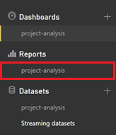
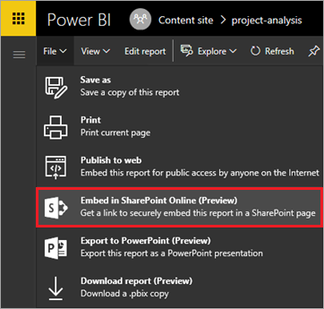
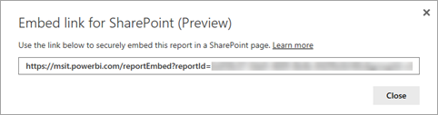
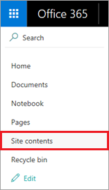
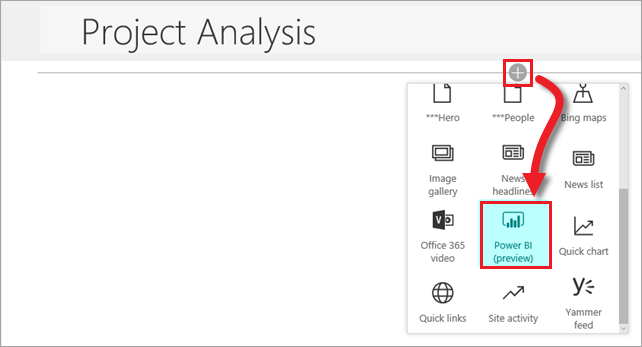
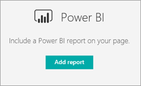

# Внедрение отчета о проекте Power BI в SharePoint Online
> [!NOTE]
> Эта статья входит в серию руководств по использованию PowerApps, Microsoft Flow и Power BI совместно с SharePoint Online. Обязательно просмотрите [вводные сведения](sharepoint-scenario-intro.md), чтобы получить общее представление о процессе и скачать связанные файлы.

Последняя задача этого сценария — внедрение отчета Power BI на тот же веб-сайт SharePoint Online, где размещены два наши списка. В Power BI доступны разные способы внедрения. Недавно мы добавили возможность интеграции непосредственно в страницы SharePoint для мобильных и веб-представлений.

Используя этот подход, Power BI внедряет отчет в качестве веб-части, предоставляет соответствующие права доступа для пользователей и позволяет переходить от внедренного отчета к отчету на веб-сайте powerbi.com. Мы создадим в Power BI ссылку для внедрения, а затем используем эту ссылку на создаваемой странице. Дополнительные сведения о внедрении см. в статье [Внедрение с помощью веб-части отчетов в SharePoint Online](https://powerbi.microsoft.com/documentation/powerbi-service-embed-report-spo) (особо рекомендуется прочесть раздел "Требования").

## Шаг 1. Создание ссылки для внедрения
1. Войдите в Power BI и в левой области навигации выберите имя отчета.
   
    
2. Выберите **Внедрить в SharePoint Online**.
   
    
3. Скопируйте ссылку для внедрения из диалогового окна в файл и нажмите кнопку **Закрыть**. Мы воспользуемся этой ссылкой после создания страницы SharePoint.
   
    

## Шаг 2. Внедрение отчета
1. Войдите в SharePoint и выберите **Содержимое сайта**.
   
    
2. Можно просто включить отчет в домашнюю страницу команды, но мы создадим для него отдельную страницу. Нажмите кнопку **Создать**, а затем выберите параметр **Страница**.
   
    
3. Введите имя страницы, например "Анализ проекта".
4. Нажмите  и выберите **Power BI**.
   
    
5. Нажмите кнопку **Добавить отчет**.
   
    
6. В области справа скопируйте URL-адрес для внедрения в поле **Ссылка на отчет Power BI**. Присвойте параметрам **Показать область фильтров** и **Показать область навигации** значение **Вкл**.
   
    
7. Теперь отчет внедрен в страницу. Нажмите кнопку **Опубликовать**, чтобы отчет стал доступным для всех, у кого есть доступ к базовому отчету.
   
    

## Шаг 3. Предоставление доступа к отчету.
Если вы, как и рекомендуется, используете группы Office 365, убедитесь, что пользователи, которым необходим доступ, являются членами рабочей области группы в службе Power BI. Так они смогут просматривать содержимое группы. См. дополнительные сведения о [создании групп в Power BI](https://powerbi.microsoft.com/documentation/powerbi-service-create-a-group-in-power-bi).

На этом мы завершим работу в Power BI для текущего сценария. Мы начали с извлечения данных из списков SharePoint в Power BI и завершили полный цикл внедрением отчета Power BI назад в SharePoint.

## Дальнейшие действия
Следующий шаг в этой серии руководств — [сквозное выполнение созданного нами рабочего процесса](sharepoint-scenario-summary.md).

