# Настройка списков для интеграции SharePoint Online с PowerApps, Microsoft Flow и Power BI
**Примечание.** Эта статья входит в серию руководств по использованию PowerApps, Microsoft Flow и Power BI с SharePoint Online. Обязательно просмотрите [вводные сведения](sharepoint-scenario-intro.md), чтобы получить общее представление о процессе и скачать связанные файлы.

Хотя в SharePoint доступно много функций для обеспечения общего доступа и совместной работы, сейчас мы сосредоточимся на одной из них — [списках SharePoint](https://support.office.com/article/Introduction-to-lists-0A1C3ACE-DEF0-44AF-B225-CFA8D92C52D7). Список — это коллекция данных с возможностью совместного использования с участниками группы и другими пользователями сайта. Сначала мы рассмотрим возможности списков, используемых в этом сценарии, а затем создадим их на сайте SharePoint Online.

## Шаг 1. Общие сведения о списках
Первый список — **Project Requests** (Запросы проекта), в который пользователь, запрашивающий проекты, добавляет запрос. Пользователь, утверждающий проекты, просматривает запрос, а затем утверждает или отклоняет его.

| **Столбец в списке** | **Тип данных** | **Примечания** |
| --- | --- | --- |
| Title |Однострочный текст |Столбец по умолчанию, используемый для имени проекта. |
| Description |Однострочный текст | |
| ProjectType |Однострочный текст |Значения: новое оборудование, обновленное оборудование, новое программное обеспечение, обновленное программное обеспечение. |
| RequestDate |Дата | |
| Requestor |Однострочный текст | |
| EstimatedDays |Номер |Позволяет сравнить результаты оценки запрашивающего с результатами руководителя проекта и фактическими результатами. |
| Approved |Однострочный текст |Значения: в ожидании, да, нет. |

**Примечание.** Также используется столбец **ID**, который создается в SharePoint. Он скрыт по умолчанию. Для простоты мы будем использовать базовые типы данных. Но в реальных приложениях могут использоваться более сложные типы, например **пользователь или группа** для столбца **Requestor**. Сведения о типах данных, поддерживаемых в PowerApps, см. в статье [Подключение Microsoft PowerApps к SharePoint](https://powerapps.microsoft.com/tutorials/connection-sharepoint-online/#known-issues).

Второй список — **Project Details** (Сведения о проекте), в котором отслеживаются сведения обо всех утвержденных проектах (например, о назначенном руководителе проекта).

| **Столбец в списке** | **Тип данных** | **Примечания** |
| --- | --- | --- |
| Title |Однострочный текст |Столбец по умолчанию, используемый для имени проекта. |
| RequestID |Номер |Совпадает со значением в столбце **ID** списка **Project Requests**. |
| ApprovedDate |Дата | |
| Состояние |Однострочный текст |Значения: не начато, выполняется, завершено. |
| ProjectedStartDate |Дата |Рассчитанная руководителем дата начала проекта. |
| ProjectedEndDate |Дата |Рассчитанная руководителем дата завершения проекта. |
| ProjectedDays |Номер |Рабочие дни; как правило, вычисляются, но не в нашем примере. |
| ActualDays |Номер |Для завершенных проектов. |
| PMAssigned |Однострочный текст |Руководитель проекта. |

## Шаг 2. Создание и просмотр списков
Для работы с этим примером нам нужно создать два списка SharePoint и заполнить их примерами данных. Мы покажем, как это сделать, создав список и вставив примеры данных. Убедитесь, что у вас есть файлы Excel из [скачиваемого пакета](https://aka.ms/o4ia0f).

**Примечание.** На этом этапе используйте Internet Explorer.

### Создание списка
1. В Internet Explorer на сайте SharePoint нажмите кнопку **Создать**, а затем щелкните **Список**.
   
    
2. Введите имя "Project Requests" и нажмите кнопку **Создать**.
   
    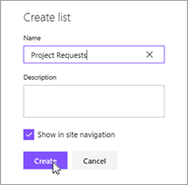
   
    Список **Project Requests** создан со столбцом **Title** по умолчанию.
   
    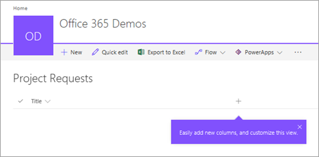

### Добавление столбцов в список
1. Щелкните  и выберите **Single line of text** (Однострочный текст).
   
    
2. Введите имя "Description" и нажмите кнопку **Создать**.
   
    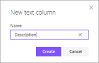
3. Повторите шаги **1** и **2** для других столбцов в списке:
   
   1. **Single line of text** (Однострочный текст) > "ProjectType"
   2. **Date** (Дата) > "RequestDate"
   3. **Single line of text** (Однострочный текст) > "Requestor"
   4. **Number** (Число) > "EstimatedDays"
   5. **Single line of text** (Однострочный текст) > "Approved"

### Копирование данных в список
1. Нажмите кнопку **Быстрое редактирование**.
   
    
2. Выделите ячейки в сетке.
   
    
3. Откройте книгу project-requests.xlsx и выделите все данные (без заголовков).
   
    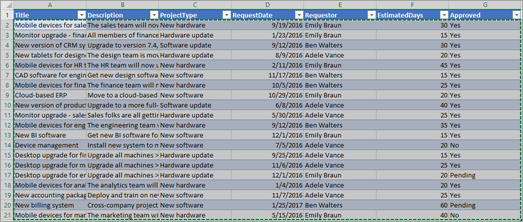
4. Скопируйте данные, вставьте их в сетку в SharePoint и нажмите кнопку **Готово**.
   
    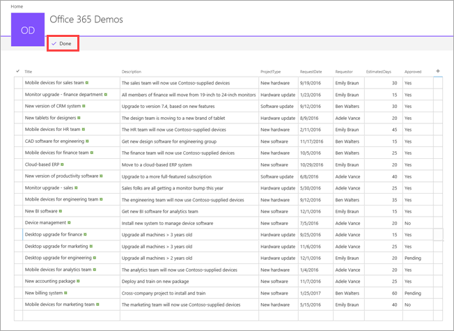
5. Повторите создание и копирование для списка "Project Details", используя книгу project-details.xlsx. Сведения об именах и типах данных столбцов см. в таблице Project Details в разделе [Шаг 1. Общие сведения о списках](#step-1-understand-the-lists).

## Шаг 3. Обновление подключения к примерам (необязательно)
Как отмечено во введении, мы включили в [скачиваемый пакет](https://aka.ms/o4ia0f) два примера приложений и пример отчета. Это руководство можно пройти и без этих примеров. Но если вы решили их использовать, вам нужно обновить подключения к спискам SharePoint. Так примеры приложений смогут использовать как источник данных *ваши* списки вместо наших.

### Обновление подключения для примеров приложений
1. Откройте файл **project-management-app.msapp** в PowerApps Studio.
2. Щелкните **Allow** (Разрешить), чтобы служба PowerApps могла использовать SharePoint.
3. На ленте откройте вкладку **View** (Представление) и щелкните **Data sources** (Источники данных).
   
    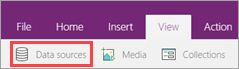
4. В области справа нажмите кнопку с многоточием (**...**) рядом с элементом **Project Details** (Сведения о проекте), а затем щелкните **Remove** (Удалить).
   
    
5. В области справа нажмите кнопку **Add data source** (Добавить источник данных).
   
    
6. Щелкните **New connection** (Создать подключение).
   
    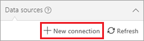
7. Щелкните **SharePoint** и нажмите кнопку **Connect** (Подключить).
   
    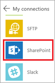
8. Введите URL-адрес сайта SharePoint Online, который содержит созданные списки, и нажмите кнопку **Go** (Перейти).
   
    
9. Выберите список **Project Details** (Сведения о проекте), а затем нажмите кнопку **Connect** (Подключить).
   
    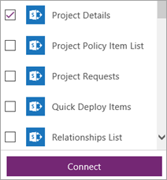
   
    На вкладке **Data sources** (Источники данных) справа отобразится созданное подключение.
   
    
10. В области справа нажмите кнопку с многоточием (**...**) рядом с элементом **Project Details**, а затем щелкните **Refresh** (Обновить).
    
    
11. В правом верхнем углу щелкните  для запуска приложения. Убедитесь, что подключения работают должным образом.
12. Повторите шаги в этом разделе с файлом **project-requests-app.msapp**, используя список **Project Requests** (Запросы проекта).

### Обновление подключений для примера отчета
1. Откройте файл **project-analysis.pbix** в Power BI Desktop.
2. На ленте откройте вкладку **Главная**, щелкните **Изменить запросы** и выберите **Параметры источника данных**.
   
    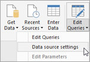
3. Нажмите кнопку **Изменить источник**.
   
    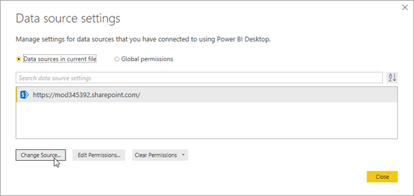
4. Введите URL-адрес сайта SharePoint Online и нажмите кнопку **ОК**.
   
    
5. В Power BI Desktop под лентой отобразится баннер, который позволяет применить изменения и перенести данные из нового источника. Нажмите кнопку **Применить изменения**.
   
    
6. Войдите с помощью корпоративной учетной записи (учетная запись для доступа к SharePoint Online) и нажмите кнопку **Подключить**.
   
    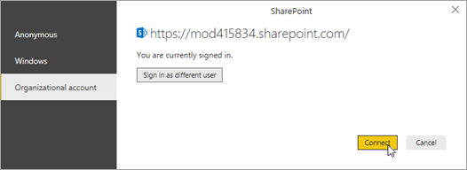

## Дальнейшие действия
Следующий этап в этой серии руководств — [создание приложения для обработки запросов проекта](sharepoint-scenario-generate-app.md).

