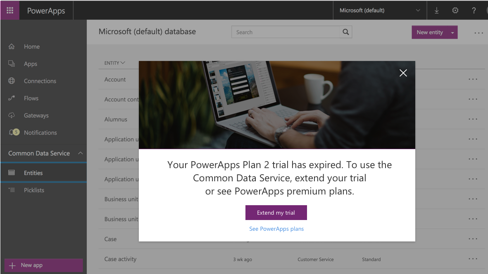
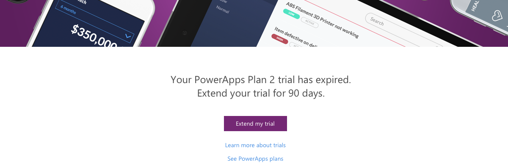

# Пробная версия (план 2) для PowerApps
Зарегистрируйтесь для использования пробной версии PowerApps (план 2), чтобы получить бесплатный доступ ко всем функциям в течение 90 дней. Кроме стандартных функций PowerApps, пробная версия включает больше ресурсов и функций в сравнении с теми, которые доступны в рамках многих [планов Office 365 и Dynamics 365](pricing-billing-skus.md). Функции уровня "Премиум" включают:

* **Доступ к службе Common Data Service** — надежной платформе бизнес-данных, встроенной в службу PowerApps. Так как эта служба содержит сотни стандартных бизнес-сущностей, все ваши приложения могут использовать одинаковые определения таких сущностей, как клиент, продукт, идея и т. д. [Дополнительные сведения](data-platform-intro.md)
* **Доступ к подключениям уровня "Премиум"**, в том числе к Salesforce, DB2, Zendesk и Common Data Service. Используя многие планы Office 365 и Dynamics 365, вы можете подключаться к таким источникам данных, как Office 365, Dynamics 365, Dropbox и Twitter. Используя пробную версию (план 2), вы также можете подключаться к данным через следующие соединители уровня "Премиум":
  
    
  
    В [полном списке](connections-list.md) соединители уровня "Премиум" отмечены значком:
  
    
* **Доступ к центру администрирования PowerApps**, который позволяет управлять средами, базами данных, пользовательскими разрешениями и политиками данных.  [Дополнительные сведения](introduction-to-the-admin-center.md)

Подробные сведения о дополнительных функциях и ресурсах, доступных в пробной версии (план 2), см. на [странице цен](https://powerapps.microsoft.com/pricing/).

Чтобы зарегистрироваться для использования пробной версии на [сайте PowerApps](https://powerapps.microsoft.com/), можно использовать рабочую или учебную учетную запись. Если у вас есть доступ к PowerApps через Office 365, Dynamics 365 или PowerApps (план 1), то при попытке доступа к функциям плана 2 вам будет предложено зарегистрироваться для использования пробной версии.

## Что происходит по истечении срока действия пробной версии?
Через 90 дней вам будет предложено запросить расширение 90-дневной пробной версии или приобрести план. Дополнительные сведения обо всех планах см. на [странице цен](https://powerapps.microsoft.com/pricing/).

* При наличии доступа к PowerApps через Office 365, Dynamics 365 или PowerApps (план 1) вы по-прежнему можете использовать PowerApps, но можете потерять доступ к службе Common Data Service, соединителям уровня "Премиум", центру администрирования и другим функциям плана 2. Например, при попытке создать подключение уровня "Премиум" может появиться этот экран:
  
    
  
    При попытке изменить схему или сущности в службе Common Data Service может появиться этот экран:
  
    
* При доступе к PowerApps только с помощью пробной версии (для использования которой вы зарегистрировались на [сайте PowerApps](http://powerapps.microsoft.com/) или [странице цен](http://powerapps.microsoft.com/pricing)) появится следующий экран:
  
    

## Как узнать, сколько дней осталось до истечения срока действия пробной версии?
Скоро вы сможете просматривать число дней, оставшихся до истечения срока действия пробной версии.

## Что происходит с данными по истечении срока действия пробной версии?
Если у вас по-прежнему есть доступ к PowerApps, вы сможете и дальше пользоваться ими. Не только все данные в службе Common Data Service останутся неизменными. Все приложения или последовательности, в которых в качестве источника данных используется Common Data Service, также будут выполняться как и раньше. Однако вы не сможете использовать такие приложения или последовательности: при попытке изменить схему или сущности в службе Common Data Service вам будет предложено запросить расширение пробной версии или приобрести план.

## Каковы следующие действия?
Доступ к службе PowerApps и ее функциям можно сохранить, выполнив одно из следующих действий:

* При появлении предложения запросить продление пробного периода еще на 90 дней.
* Приобрести план. Вы можете просмотреть доступные планы или посетить страницу с ценами на PowerApps. См. [дополнительные сведения](signup-for-powerapps-admin.md) о том, как приобрести план.

