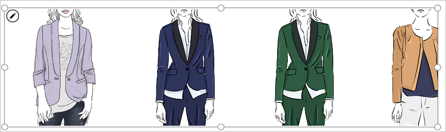

# Как сохранить изображения в файл Excel и добавить их в приложение

В этом руководстве вы выполните следующие действия.

* Создадите файл Excel и отформатируете его как таблицу.
* Создадите подключение к OneDrive для бизнеса. Подойдет любая облачная учетная запись хранения. В этом пошаговом руководстве используется OneDrive для бизнеса.
* Создадите приложение с помощью элемента управления "Ввод с помощью пера".
* Сохраните в файл Excel изображения, созданные с помощью элемента управления "Ввод с помощью пера".
* Отобразите в приложении изображения из файла Excel.

[!INCLUDE [app-customization-requirements](includes/app-customization-requirements.md)]
* Узнайте, как [добавить источник данных](add-data-connection.md)

## Создание таблицы в формате файла Excel

1. Откройте пустой файл Excel и присвойте в нем столбцу имя **Image [image]**.
2. Создайте таблицу, выполнив следующие действия:    
   
   1. Выберите любой элемент данных в любой строке и любом столбце. Например, выберите **изображение**.
   2. На ленте **Вставка** выберите элемент **Таблица**.
   3. В диалоговом окне выберите вариант **Таблица с заголовками** и выберите **ОК**.
      
      Теперь файл Excel имеет формат таблицы. Статья [Форматирование таблицы Excel](https://support.office.com/article/Format-an-Excel-table-6789619F-C889-495C-99C2-2F971C0E2370) содержит дополнительные сведения о формате таблицы в Excel.
   4. Присвойте этой таблице имя **Drawings**:  
      
      
3. Присвойте файлу Excel имя **SavePen.xlsx** и сохраните файл в облачную учетную запись хранения (OneDrive для бизнеса, Dropbox и т. п).

## Создание приложения с элементом управления "Ввод с помощью пера"
1. В службе PowerApps создайте [пустое приложение](get-started-create-from-blank.md).
2. В этом приложении добавьте облачную учетную запись хранения в качестве [источника данных](add-data-connection.md). Когда вы добавите источник данных, добавьте файл **SavePen.xlsx** в роли подключения, а затем выберите таблицу **Drawings**.  
     
   
   Теперь таблица Drawings отображается как источник данных.
3. В меню **Вставка** выберите **Текст**, а затем —элемент управления **Ввод с помощью пера**. Присвойте ему имя **MyPen**:  
   
   
4. Добавьте элемент управления **Кнопка** (через меню **Вставка**) и задайте в качестве значения свойства **OnSelect** следующую формулу:  
   `Patch(Drawings, Defaults(Drawings), {Image:MyPen.Image})`
5. Добавьте в приложение элемент управления **Коллекция изображений** (через меню **Вставка** > **Коллекция**) и назначьте его свойству **Items** значение `Drawings`. Свойство **Image** для элемента управления "Коллекция" автоматически получает значение `ThisItem.Image`.
   
   Окно должно выглядеть следующим образом:  
   
     
6. Нажмите клавишу F5 или выберите значок предварительного просмотра (). Нарисуйте что-нибудь в элементе управления MyPen, затем выберите кнопку. Теперь первое изображение в элементе управления "Коллекция" демонстрирует ваш новый рисунок. Дорисуйте еще что-нибудь и снова нажмите кнопку. Теперь второе изображение в элементе управления "Коллекция" демонстрирует ваш новый рисунок.
   
   Закройте окно предварительного просмотра.
7. Перейдите к облачной учетной записи хранения. Вы увидите автоматически созданную папку **SavePen_images**. Возможно, потребуется обновить информацию, чтобы увидеть папку. Эта папка содержит сохраненные изображения с идентификаторами в качестве имен файлов.
   
    Откройте файл SavePen.xlsx. Столбец Image содержит путь к вашим новым изображениям.

## Добавление в приложение изображений из файла Excel
В следующем примере вы сохраните изображения в облачную учетную запись хранения, а затем примените таблицу Excel для отображения изображений в приложении.

Для этого примера нам понадобится файл [CreateFirstApp.zip](http://pwrappssamples.blob.core.windows.net/samples/CreateFirstApp.zip) с несколькими изображениями в формате JPEG.

> [!NOTE]
> Если вы используете файл Excel для отображения изображений, путь к файлам должен содержать символы косой черты. Когда PowerApps сохраняет изображения в таблице Excel (как в предыдущих шагах), путь к файлам содержит символы обратной косой черты. Вы можете использовать в этом примере файлы **SavePen_images** из предыдущего примера. Но для этого нужно изменить пути в таблице Excel, заменив все символы обратной косой черты обычной косой чертой. В противном случае изображения не будут отображаться.  

1. Загрузите файл [CreateFirstApp.zip](http://pwrappssamples.blob.core.windows.net/samples/CreateFirstApp.zip) и извлеките папку **Assets** в облачную учетную запись хранения.
2. В электронной таблице Excel создайте таблицу, которая выглядит следующим образом:
   
    
3. Присвойте этой таблице имя **Jackets**. Присвойте файлу Excel имя **Assets.xlsx**. Также можно переименовать папку **Assets**, например в **Assets_images**.
4. В приложении добавьте таблицу **Jackets** в качестве источника данных.  
5. Добавьте в приложение элемент управления **Только изображение** (через меню **Вставка** > **Коллекция**) и назначьте его свойству **Items** значение `Jackets`.  
   
    
   
    Коллекция автоматически заполнится изображениями.  
   
    

Когда вы присваиваете значение свойству Items, в таблицу Excel автоматически добавляется новый столбец с именем **PowerAppsId**.

В таблице Excel путь к изображению может содержать URL-адрес изображения. Загрузите пример файла [Flooring Estimates](http://pwrappssamples.blob.core.windows.net/samples/FlooringEstimates.xlsx) в облачную учетную запись хранения, добавьте таблицу `FlooringEstimates` в качестве источника данных для приложения, а затем установите значение `FlooringEstimates` для элемента управления "Коллекция". Коллекция автоматически заполнится изображениями.

## Дополнительные сведения
[Using multimedia files in PowerApps](add-images-pictures-audio-video.md) (Использование файлов мультимедиа в PowerApps)  
[Show data in a line, pie, or bar chart in your app](use-line-pie-bar-chart.md) (Отображение данных в виде графика, круговой или линейчатой диаграммы)  
[Understand tables and records in PowerApps](working-with-tables.md) (Общие сведения о таблицах и записях PowerApps)

