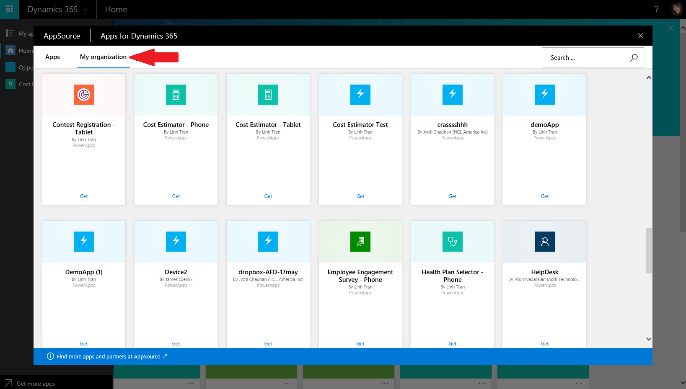

# Поиск приложений через AppSource
Приложения, которые вы создаете и публикуете с помощью PowerApps, доступны для поиска и использования в службе Dynamics 365 в Интернете. В ней отображаются все приложения: как те, которые вы явным образом выбрали для использования (то есть запустили из сообщения электронной почты о предоставлении доступа или открыли из AppSource), так и те, которые подготовил для вас администратор. Сюда входят все ваши приложения в PowerApps, а также приложения Dynamics 365 от Майкрософт. Вы можете искать приложения, фильтровать их по средам, а также закреплять вверху страницы приложения, которые используете чаще всего.

  

## Поиск приложений в коллекции организации AppSource
Служба Microsoft AppSource теперь доступна на домашней странице [Dynamics 365](http://home.dynamics.com) и в стандартной системе навигации. Она включает частную коллекцию приложений, которые доступны вам в вашей организации. Выберите **Get more apps** (Другие приложения) на домашней странице или в области задач и откройте вкладку **My Organization** (Моя организация), чтобы увидеть приложения, которые вам доступны.

По умолчанию все приложения, которые созданы с помощью PowerApps и доступ к которым предоставлен вашей группе безопасности или всей организации с разрешением категории **Пользователь**, отображаются здесь, а не на вашей домашней странице. Приложения, полученные через AppSource, будут появляться на этой странице, и вы сможете легко вызывать их.

  
