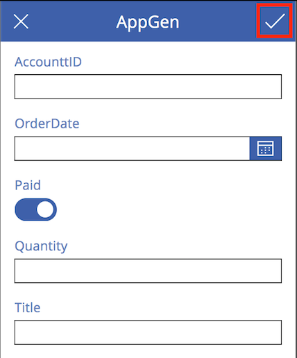
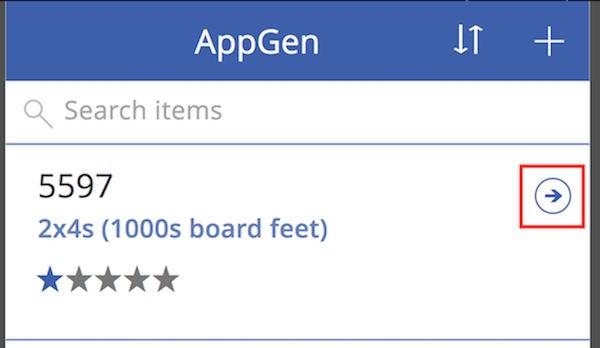

# Открытие приложения из списка SharePoint
Вы можете открыть существующее приложения в SharePoint Online и управлять списком.

Сведения о типах данных SharePoint, поддерживаемых PowerApps, приведены в разделе [Известные проблемы](../maker/canvas-apps/connections/connection-sharepoint-online.md#known-issues).

## Технические условия
[Создайте приложение в интерфейсе SharePoint](../maker/canvas-apps/generate-app-from-sharepoint-list-interface.md).

## Открытие приложения
1. Откройте список SharePoint Online и выберите приложение из него.
   
    
2. Щелкните или коснитесь **Open** (Открыть).
   
    
   
    Приложение откроется на отдельной вкладке браузера.
   
    

## Управление списком с помощью приложения
> [!NOTE]
> В этом разделе описывается, как открыть и запустить приложение, которое автоматически создается из списка SharePoint. Чаще всего созданное приложение всесторонне настраивается в соответствии с потребностями вашей организации. В этом случае использовать его может быть несколько сложнее, чем описано в этом разделе.
> 
> 

1. Откройте приложение, как описано в предыдущей процедуре.
2. Чтобы добавить элемент в список, щелкните знак "+" или коснитесь его.
   
    
3. Отобразится форма для ввода значений в поля списка. По завершении щелкните галочку или коснитесь ее.
   
    
4. Чтобы просмотреть сведения об элементе, щелкните стрелку или коснитесь ее.
   
    
5. Чтобы изменить элемент, в отобразившейся форме щелкните значок "Карандаш" или коснитесь его.
   
    
6. Внесите необходимые изменения, а затем щелкните галочку или коснитесь ее.
   
    
7. Чтобы удалить элемент, в окне просмотра сведений щелкните значок "Корзина" или коснитесь его.
   
    

