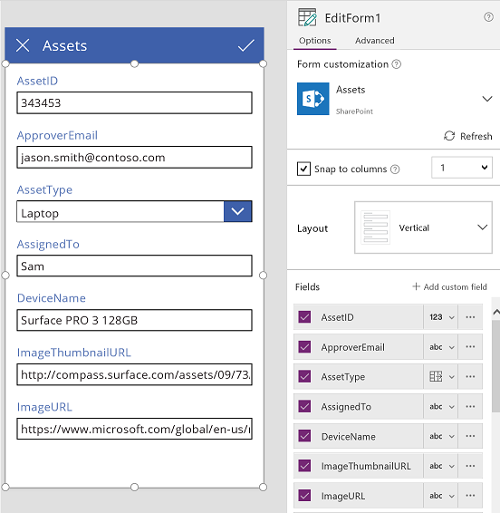
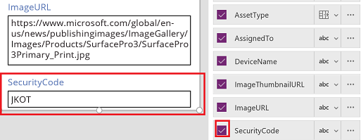
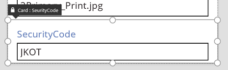
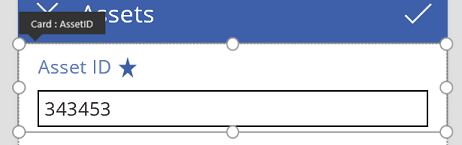
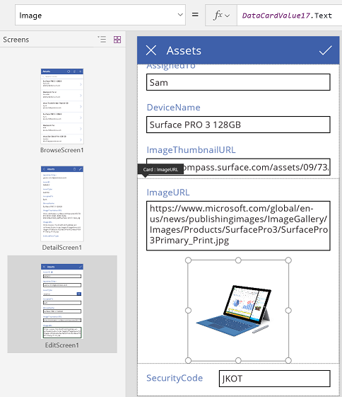
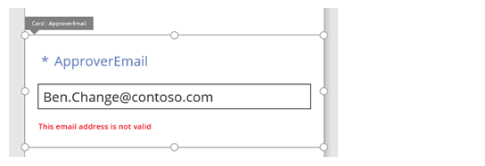

# Общие сведения о карточках данных
Элементы управления **[Карта](controls/control-card.md)** являются стандартными блоками элементов управления **[Форма редактирования](controls/control-form-detail.md)** и **[Форма отображения](controls/control-form-detail.md)**. Форма представляет всю запись, а каждая карта представляет одно поле этой записи.

Выбрав элемент управления формы в рабочей области конструирования, вы сможете работать с карточками на панели справа. На этой панели можно выбрать отображаемые поля, способ отображения каждого поля и их порядок. В этом примере показан элемент управления **Форма изменения** в приложении, созданном из списка SharePoint с именем **Assets**.

Чтобы начать работу с картами, см. статьи о [добавлении формы](add-form.md) и [формах данных](working-with-forms.md). В оставшейся части этой статьи приведены более подробные сведения о принципе действия карт, а также об их настройке и создании.

## Предопределенные карты
В PowerApps предусмотрен предопределенный набор карт для строк, чисел и других типов данных. В области справа можно просмотреть доступные варианты и изменить карту, используемую для поля.

В этом примере выбрана однострочная текстовая карта, но текст URL-адреса не вмещается в одной строке. Давайте изменим тип карты на многострочную текстовую, чтобы предоставить пользователям больше места для редактирования:

Некоторые поля этого источника данных не отображаются. Но вы можете отобразить или скрыть поле, установив соответствующий флажок. В этом примере показано, как отобразить поле **SecurityCode**.

## Настройка карточки
Карты содержат другие элементы управления. В элементе управления **Форма изменения** пользователь вводит данные в стандартном элементе управления **[Текстовое поле](controls/control-text-input.md)**, который можно добавить на вкладке **Вставка**.  

Давайте рассмотрим пример с изменением вида карточки, используя элементы управления на ней.

1. Сначала давайте вернемся к недавно вставленной карте для поля **SecurityCode**. Щелкните или коснитесь ее один раз, чтобы выбрать.
   
    
2. Выберите элемент управления **[Текстовое поле](controls/control-text-input.md)** в карте, коснувшись или щелкнув его.
   
    
3. Переместите этот элемент управления в карте, перетащив рамку выделения, и измените его размер, перетаскивая маркеры, расположенные по краям рамки выделения.
   
      

Вы можете перемещать элементы управления и изменять их размер, а также выполнять с ними другие действия в карточке. Но их невозможно удалить, не разблокировав.

## Разблокировка карточки
Кроме того, что карты содержат элементы управления, они сами являются элементами управления и подобно другим элементам управления имеют свойства и формулы. Если нужно отобразить поле в форме, область справа автоматически создает карту и необходимые формулы.  Эти формулы отображаются на вкладке **Дополнительно** в области справа.

Одно из самых важных свойств карты, **[DataField](controls/control-card.md)**, отображается сразу. Это свойство указывает отображаемые поля источника данных, которые можно изменить на этой карте.  

На вкладке **Дополнительно** на баннере в верхней части указано, что свойства этой карточки заблокированы. Значок блокировки также отображается рядом со свойствами **[DataField](controls/control-card.md)**, **[DisplayName](controls/control-card.md)** и **[Required](controls/control-card.md)**. Эти формулы созданы областью справа, а блокировка предотвращает случайное изменение этих свойств.

Щелкните или коснитесь баннера в верхней части, чтобы разблокировать карту и изменить эти свойства.

Давайте изменим свойство **[DisplayName](controls/control-card.md)**, чтобы вставить пробел между **Asset** и **ID**. Таким образом мы изменим автоматически созданные значения.  В области справа эта карта имеет другую метку.

Теперь мы можем управлять этой картой и изменять ее в соответствии с собственными потребностями. Но мы не можем изменить представление карты (например, однострочный или многострочный текст), подобно тому, как мы делали раньше. Мы превратили предопределенную карту в пользовательскую и теперь можем управлять ей.  

**Важно!** Разблокированную карточку невозможно заблокировать. Чтобы заблокировать карточку, удалите ее и снова вставьте в области справа.

Вы можете изменять вид и поведение разблокированной карточки разными способами, например добавляя и удаляя элементы управления на карточке. Например, можно добавить фигуру звезды, выбрав ее в меню **Значки** на вкладке **Вставка**.

Теперь эта фигура является частью карточки и будет перенесена вместе с ней, например, при изменении порядка карточек в форме.

Давайте рассмотрим другой пример. Разблокируйте карточку **ImageURL** и добавьте в нее элемент управления **Изображение** на вкладке **Вставка**.

В строке формул задайте для свойства **Image** этого элемента управления значение *TextBox*.**Text**, где *TextBox* — это имя элемента управления **Текстовое поле**, содержащего URL-адрес.

**Совет.** Нажмите клавишу ALT для отображения имени каждого элемента управления.

Теперь изображения отображаются, и мы можем изменить их URL-адреса. Обратите внимание: вы можете использовать **Parent.Default** как значение свойства **Image**, но оно не обновится после изменения URL-адреса.

То же можно сделать на втором экране этого приложения, где используется элемент управления **Форма отображения** для отображения сведений о записи. В этом случае можно скрыть метку, задав для свойства **Visible** элемента управления "Метка" (не для карточки) значение **false**, так как пользователь не будет изменять URL-адрес на этом экране.

## Взаимодействие с формой
Для разблокированной карточки можно изменить способ взаимодействия с формой, которая содержит.

Ниже приведены некоторые рекомендации о взаимодействии элементов управления с картами и карт с формой. Это только рекомендации. Как и в случае с любым элементом управления в PowerApps, вы можете создавать формулы, ссылающиеся на любой другой элемент управления в PowerApps. То же касается карт и элементов управления на них. Приложение можно создать множеством способов. Реализуйте свой творческий потенциал!  

### Свойство DataField
Самое важное свойство карты — **[DataField](controls/control-card.md)**.  Это свойство отвечает за проверку, за обновляемое поле и другие аспекты карты.

### Ввод сведений
В качестве контейнера форма делает запись **ThisItem** доступной для всех карт, содержащихся в ней. Эта запись содержит все поля в текущей записи.  

Свойству **[Default](controls/properties-core.md)** всех карт нужно присвоить значение **ThisItem**.*FieldName*.  В некоторых случаях может понадобиться преобразовать это значение при передаче. Например, вам может потребоваться отформатировать строку или преобразовать значение, чтобы использовать его в другом языке.

Каждый элемент управления в карте должен ссылаться на **Parent.Default**, чтобы получить значение поля. Эта стратегия обеспечивает определенный уровень инкапсуляции карты, чтобы свойство карты **[Default](controls/properties-core.md)** можно было изменить, не меняя ее внутренние формулы.

По умолчанию свойства **DefaultValue** и **[Required](controls/control-card.md)** можно получить из метаданных источника данных на основе свойства **[DataField](controls/control-card.md)**. Вы можете переопределить эти формулы собственной логикой, интегрировав метаданные источника данных, используя функцию **[DataSourceInfo](functions/function-datasourceinfo.md)**.

### Вывод сведений
После того как пользователь изменит записи с помощью элементов управления в картах, функция **[SubmitForm](functions/function-form.md)** сохраняет эти изменения в источнике данных. При выполнении этой функции элемент управления формы считывает значения свойства **[DataField](controls/control-card.md)** каждой карты, чтобы определить поля, которые следует изменить.  

Кроме того, элемент управления формы также считывает значение свойства **[Update](controls/control-card.md)** каждой карты. Это значение будет храниться в источнике данных для этого поля. На этом этапе можно применить еще одно преобразование, например обратить преобразование, примененное в формуле карты **[Default](controls/properties-core.md)**.

Свойство **Valid** можно получить из метаданных источника данных на основе свойства **[DataField](controls/control-card.md)**. Кроме того, учитывается свойство **[Required](controls/control-card.md)**, а также то, содержит ли свойство **[Update](controls/control-card.md)** значение. Если свойству **[Update](controls/control-card.md)** назначено недопустимое значение, свойство **Error** отображает понятное сообщение об ошибке.

Если свойство **[DataField](controls/control-card.md)** карты *пустое*, карта является всего лишь контейнером элементов управления. При отправке формы свойства **Valid** и **[Update](controls/control-card.md)** не задействованы.

## Разбор примера
Давайте рассмотрим элементы управления, входящие в базовую карту ввода данных. Пространство между элементами управления было увеличено для более четкого отображения каждого из них:

Удерживайте клавишу ALT, чтобы показать имена элементов управления этой карты.

Эта карта действует за счет четырех элементов управления:

| Имя | Тип | Описание |
| --- | --- | --- |
| **TextRequiredStar** |Элемент управления **[Метка](controls/control-text-box.md)** |Отображает звездочку, которая часто используется в формах ввода данных, чтобы указать, что поле является обязательным. |
| **TextFieldDisplayName** |Элемент управления **[Метка](controls/control-text-box.md)** |Отображает понятное имя этого поля. Это имя может отличаться от имени на схеме источника данных. |
| **InputText** |Элемент управления **Текстовое поле** |Отображает начальное значение поля, которое пользователь может изменить. |
| **TextErrorMessage** |Элемент управления **[Метка](controls/control-text-box.md)** |Отображает понятное сообщение об ошибке для пользователя при возникновении проблемы с проверкой. Кроме того, этот элемент управления гарантирует наличие значения в поле, если это значение является обязательным. |

Чтобы заполнить эти элементы управления данными, их свойства можно получить из свойств карты, применяя следующие основные формулы. Обратите внимание, что ни одна из этих формул не относится к определенному полю. Вместо этого все данные можно получить из карты.

| Свойство элемента управления | Формула | Описание |
| --- | --- | --- |
| **TextRequiredStar.Visible** |**Parent.Required** |Звездочка появляется, только если поле является обязательным. Требуется формула, которую указывает пользователь или которую можно получить из метаданных источника данных. |
| **TextFieldDisplayName.Text** |**Parent.DisplayName** |Элемент управления "Текстовое поле" отображает понятное имя, которое предоставляет пользователь или метаданные источника данных и которое задается в свойстве карты **[DisplayName](controls/control-card.md)**. |
| **InputText.Default** |**Parent.Default** |Элемент управления "Текстовое поле" изначально отображает значение поля из источника данных, указанное в значении карты по умолчанию. |
| **TextErrorMessage.Text** |**Parent.Error** |При возникновении проблемы проверки свойство карты **Error** выдает соответствующее сообщение об ошибке. |

Чтобы получить сведения из этих элементов управления и передать их обратно в источник данных, используйте следующие основные формулы:

| Имя элемента управления | Формула | Описание |
| --- | --- | --- |
| **DataCard.DataField** |**ApproverEmail** |Имя поля, которое пользователь может отобразить и изменить в этой карте. |
| **DataCard.Update** |**InputText.Text** |Значение, которое следует проверить и передать обратно в источник данных при выполнении **[SubmitForm](functions/function-form.md)**. |

