# Общие сведения о макетах форм данных в Microsoft PowerApps
В PowerApps вы можете легко создавать привлекательные и эффективные в использовании формы. Например, рассмотрим следующую простую форму записи для заказа на продажу.

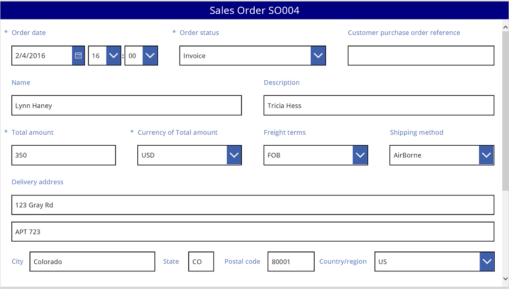

В этом руководстве мы подробно изучим ее создание. Мы также остановимся на некоторых дополнительных темах, например динамическом изменении размера полей для заполнения доступного пространства.

## Перед началом работы
Если вы впервые работаете с PowerApps (или создавали приложения только автоматически), перед изучением этой статьи потребуется [создать приложение с нуля](get-started-create-from-blank.md). Создав приложение с нуля, вы ознакомитесь с такими важными понятиями, как добавление источников данных и элементов управления, которые упоминаются, но подробно не рассматриваются в этой статье.

## Добавление коллекции
1. Создайте планшетное приложение с нуля.
   
    Хотя в этой статье рассматриваются и макеты для телефона, приложения для телефона часто содержат только один вертикальный столбец.
2. Добавьте сущность **Sales order** в службу [Common Data Service](data-platform-intro.md) в качестве источника данных для приложения.
   
    Вне этого руководства можно использовать любой источник данных, включая списки SharePoint и таблицы Excel.
3. Добавьте вертикальный элемент управления **Коллекция** и укажите для его свойства **Items** значение **Sales order**.
   
    Необязательно. В соответствии с примерами в этом руководстве измените **макет** коллекции так, чтобы отображались только **заголовок и подзаголовок**.
   
    
4. В коллекции выберите **SO004**.
   
    
   
    Эта запись будет отображаться в форме, которую мы создадим позже в соответствии с инструкциями в этой статье.

## Добавление строки заголовка
1. Добавьте пустой экран для размещения формы.
   
    Вне этого руководства можно разместить элементы управления **Коллекция** и **[Форма редактирования](controls/control-form-detail.md)** на одном экране. Но вы получите больше возможностей для работы, если поместите их в отдельных окнах.
2. В верхней части нового экрана добавьте элемент управления **[Метка](controls/control-text-box.md)** и задайте для ее свойства **Text** это выражение:
    **"Sales Order " & Gallery1.Selected.SalesOrderId**
   
    В метке указан номер заказа на продажу для записи, которую вы выбрали в коллекции.
3. Необязательно. Отформатируйте метки следующим образом:
   
   1. Для свойства **Align** (Выравнивание) выберите вариант **Center** (По центру).
   2. Для свойства **Size** задайте значение **20**.
   3. Для свойства **Fill** задайте значение **Navy**.
   4. Для свойства **Color** задайте значение **White**.
   5. Для свойства **Width** задайте значение **Parent.Width**.
   6. Для свойств **X** и **Y** задайте значение **0**.
      
      

## Добавление формы
1. Добавьте элемент управления **Форма редактирования**, а затем переместите его и измените его размер в соответствии с экраном с меткой.
   
    На следующем этапе необходимо подключить элемент управления формы к источнику данных **Sales order** с помощью панели справа, не используя строку формул. Если вы используете строку формул, по умолчанию в форме не будут отображаться поля. Всегда можно настроить отображение требуемых полей, установив один или несколько флажков на панели справа.
2. На панели справа выберите стрелку вниз рядом с элементом **Источник данных не выбран** и выберите **Sales order**.
   
    В простом макете из трех столбцов отобразится стандартный набор полей для источника данных **Sales order**. Но многие ячейки будут пусты, и для окончательной расстановки значений может потребоваться несколько минут.  
3. Задайте для свойства формы **Item** значение **Gallery1.Selected**.
   
    В форме будет представлена запись, выбранная в коллекции, но набор полей по умолчанию может не соответствовать требованиям для конечного продукта.
4. В области справа скройте каждое из этих полей, сняв соответствующий флажок:
   
   * **Sales order ID**
   * **Account**
   * **Sales person**
   * **Account contact**
5. Перетащите поле **Order status** влево, поместив его с другой стороны от поля **Customer purchase order reference**.
   
    Экран должен выглядеть следующим образом:
   
    

## Выбор карточки данных
У каждого отображаемого поля в форме есть соответствующая карточка данных. Эта карточка состоит из набора элементов управления для поля заголовка, поля ввода, звездочки (которая отображается, если это обязательное поле) и сообщения об ошибке при проверке.

Можно также выбрать карточки непосредственно на форме. Над выбранной карточкой появляется черный заголовок.

**Примечание**. Чтобы удалить (а не просто скрыть) карточку, выберите ее и нажмите клавишу удаления.

## Упорядочение карточек в столбцах
По умолчанию формы в планшетных приложениях состоят из трех столбцов, а в приложениях для телефонов — из одного. Можно указать не только число столбцов в форме, но и соответствие размера всех карточек границам столбца.

На этом графике число столбцов в форме увеличено с трех до четырех с помощью флажка **Прикрепление к столбцам**. Карточки в форме автоматически упорядочены в соответствии с новым макетом.

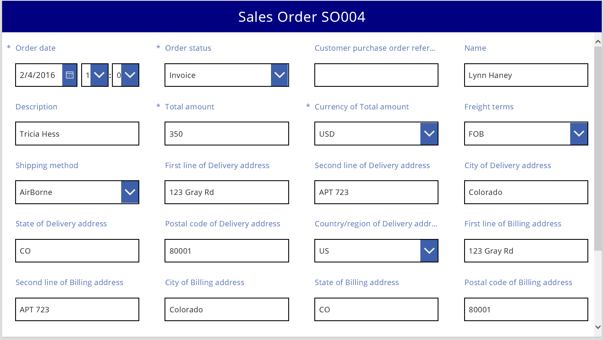

## Изменение размера карточек в нескольких столбцах
В зависимости от данных в каждой карточке вы можете привести размер некоторых карточек в соответствие границами столбца, а других — в соответствие с границами нескольких столбцов. Если карточка содержит больше данных, чем требуется для отображения в одном столбце, можно расширить столбец. Для этого выберите столбец и перетащите маркер захвата на левую или правую границу рамки выделения. Когда вы перетащите маркер, края карточки прикрепятся к границам столбца.

Чтобы повысить гибкость проекта, сохранив определенную структуру, можно увеличить число столбцов до 12. После этого изменения можно легко настроить каждую карточку для заполнения всей формы, ее половины, трети, четверти, одной шестой и т. д. Давайте рассмотрим это на практике.

1. На панели справа задайте для числа столбцов в форме значение **12**.
   
    
   
    Форма визуально не изменяется, но появилось больше точек прикрепления при перетаскивании маркера захвата влево или вправо.
2. Увеличьте ширину карточки **Order date**, перетащив маркер захвата на правой точке прикрепления вправо.
   
    Карточка займет 4 из 12 столбцов формы (или 1/3 формы), вместо 3 из 12 (или 1/4 формы). Каждый раз, когда вы увеличиваете ширину карточки на одну точку прикрепления, карточка дополнительно занимает 1/12 формы.
   
    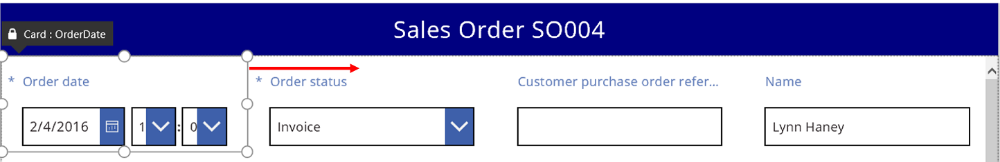
3. Повторите предыдущий шаг с карточками **Order status** и **Customer purchase order reference**.
   
    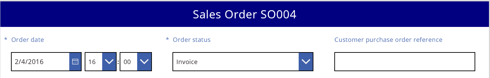
4. Измените размер карточек **Name** и **Description** так, чтобы они занимали шесть столбцов (или 1/2) формы.
5. Растяните карточку "First line of the Delivery address" на всю ширину формы.

Готово. Мы получили требуемую форму, содержащую строки со столбцами разного размера.

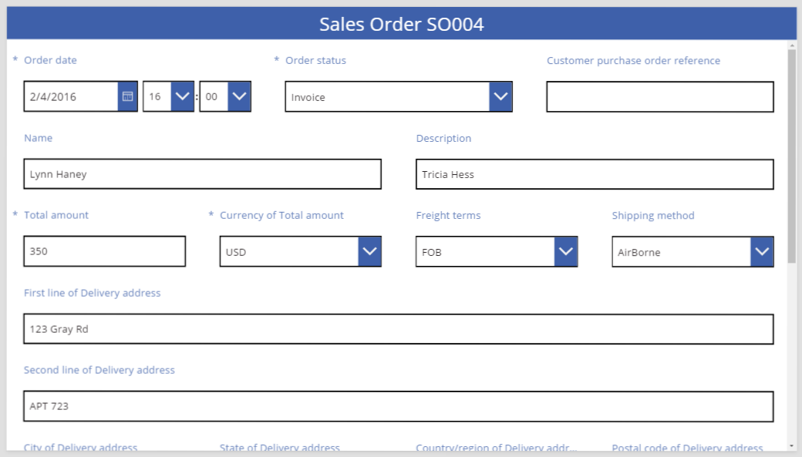

## Управление элементами управления в карточке
Адрес доставки содержит несколько блоков информации, которые необходимо визуально сгруппировать для пользователя. Каждое поле останется в своей карточке данных, но мы можем оперировать элементами управления в карточке, чтобы вписать их наилучшим образом.

1. Выберите карточку **First line of Delivery address**, выберите метку для этой карточки и удалите из текста первые три слова.
   
    
2. Выберите карточку **Second line of Delivery address**, выберите метку для этой карточки и удалите в ней весь текст.
   
    Возможно, вам покажется, что проще удалить элемент управления "Метка", и во многих случаях это вполне можно сделать. Но в форме могут быть формулы, зависящие от этого элемента управления. Более безопасное решение — удалить текст или задать для свойства **Visible** элемента управления значение **false**.
   
    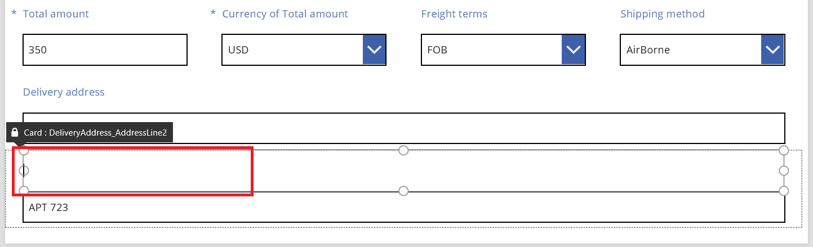
3. В той же карточке переместите поле ввода текста на метку, чтобы уменьшить отступ между первой и второй строками адреса.
   
    Если содержимое занимает меньше места, высота карточки автоматически уменьшается.
   
    

Теперь перейдем к третьей строке адреса. Давайте аналогичным образом сократим текст меток для этих карточек и поместим поле ввода текста справа от каждой метки. Ниже приведены инструкции для карточки **State of Delivery address**.

| Шаг | Описание | Возвращаемый результат |
| --- | --- | --- |
| 1 |Выберите карточку **State of Delivery address**, чтобы на ее краях появились маркеры захвата. | |
| 2 |Выберите метку в этой карточке, чтобы на ее краях появились маркеры захвата. |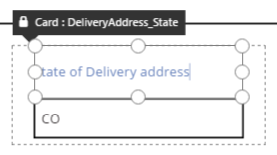 |
| 3 |Поместите курсор справа от текста и удалите ненужную его часть. | |
| 4 |С помощью маркеров на краях элемента управления "Метка" измените его размер в соответствии с новым текстом. |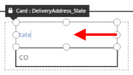 |
| 5 |Выберите элемент управления "Текстовое поле" в данной карточке. | |
| 6 |Используя маркеры на краях элемента управления "Текстовое поле", измените его размер до нужной вам величины. | |
| 7 |Перетащите поле ввода текста вверх и поместите его справа от элемента управления "Метка". |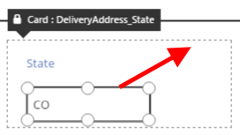 |
| Мы внесли все необходимые изменения в карточку **State of Delivery address**. |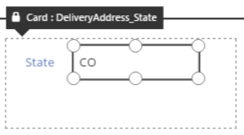 | |

Пример заполненной третьей строки адреса показан ниже.

Обратите внимание на то, что многие карточки начинаются с динамических формул, указанных для их свойств. Например, элемент управления "Текстовое поле", размер и положение которого мы изменили, содержит свойство **Width**, определяющее ширину его родительского элемента. При перемещении или изменении размера эти динамические формулы заменяются статическими значениями. При необходимости вы можете восстановить динамические формулы с помощью строки формул.

## Отключение прикрепления к столбцам
Иногда может потребоваться более точное управление, чем могут обеспечить стандартные 12 столбцов. В этих случаях можно отключить функцию **Прикрепление к столбцам** и разместить карточки вручную. Форма будут по-прежнему прикреплена к 12 столбцам, но вы сможете нажать и удерживать клавишу ALT, чтобы вручную изменить положение и размер карточки.

В нашем примере третья строка адреса состоит из четырех компонентов одинаковой ширины. Возможно, такой макет будет далек от идеального, так как название города часто бывает длиннее сокращения для названия области, республики, края или округа, и поле для ввода страны или региона уменьшается из-за длины его метки.

Чтобы оптимизировать эту область, отключите **Прикрепление к столбцам** на панели справа, а затем удерживайте нажатой клавишу ALT при изменении размера и положений этих карточек. Когда вы удерживаете нажатой клавиши ALT, над всеми элементами управления отображаются черные заголовки. Это сделано специально, чтобы показать имена элементов управления.

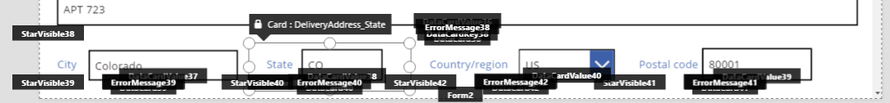

После аккуратного размещения поля станут соответствующих размеров, а интервал между ними будет одинаковым.

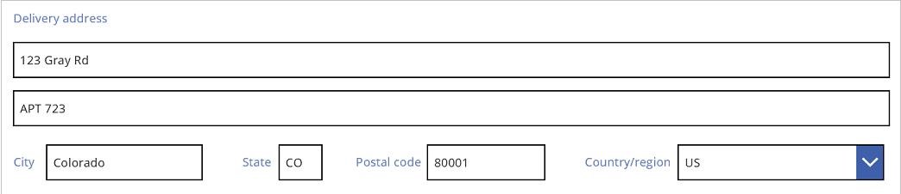

Так в чем состоит разница между включением и отключением функции **Прикрепление к столбцам**?

| Поведение | Прикрепление к столбцам включено | Прикрепление к столбцам отключено |
| --- | --- | --- |
| Прикрепление при изменении размера |Для выбранного числа столбцов: 1, 2, 3, 4, 6 или 12. |Для 12 столбцов |
| Возможность переопределить прикрепление при изменении размера |Нет |Да, с помощью клавиши ALT. |
| Карточки автоматически размещаются в строках (позже мы подробнее рассмотрим это). |Да |Нет |

## Установка ширины и высоты
Как и любым элементом в PowerApps, макетом формы управляют свойства элементов управления в карточке. Как описано выше, значения этих свойств можно изменить. Для этого переместите элементы управления в другое место или перетащите маркеры захвата, чтобы изменить размер элементов управления. Но будут ситуации, в которых нужно определить и изменить эти свойства с более высокой точностью, например, при создании динамических форм с формулами.

### Базовый макет: X, Y и Width
Положением карточек управляют свойства **X** и **Y**. Когда мы работаем с элементами управления на холсте, эти свойства обеспечивают абсолютное позиционирование. В форме эти свойства имеют иное значение:

* **X**: порядок в строке;
* **Y**: номер строки.

Как и в элементах управления на холсте, свойство **Width** указывает минимальную ширину карточки (чуть позже мы подробнее остановимся на этом).

Давайте рассмотрим свойства **X**, **Y** и **Width** карточек в нашей форме.

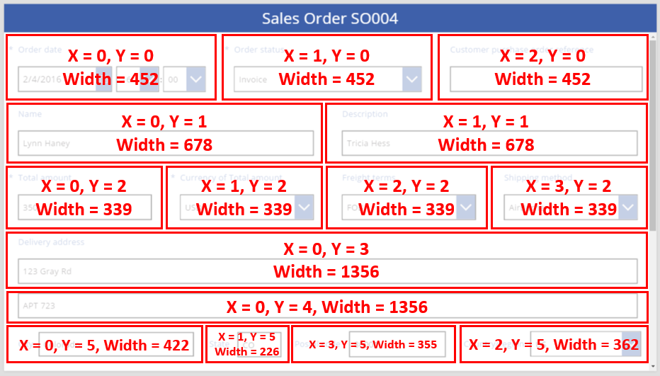

### Переполнение строк
Что произойдет, если карточки окажутся слишком широки и не поместятся в строку? Обычно об этой возможности не нужно беспокоиться. Если функция **Прикрепление к столбцам** включена, эти три свойства будут автоматически настроены так, чтобы все элементы поместились в строке без переполнения.

Но если функция **Прикрепление к столбцам** отключена или в одной либо нескольких карточках используется формула на основе свойства **Width**, может произойти переполнение строки. В этом случае автоматически будет создана новая строка, и карточки будут перенесены в нее. Например, давайте вручную изменим свойство **Width** карточки **Customer purchase order reference** (первая строка, третий элемент) на **500**.

Три карточки в верхней строке уже не помещаются в ней по горизонтали, поэтому из-за переполнения была создана еще одна строка. Координата **Y** этих карточек не изменилась и осталась равной 0, а координата **Y** карточек **Name** и **Description** по-прежнему равна 1. Карточки с разными значениями **Y** не объединяются по строкам.

Можно использовать это поведение для создания полностью динамического макета, в котором карточки располагаются в Z-образном порядке, максимально заполняя пространство, а затем перемещаясь на следующую строку. Чтобы добиться этого, задайте для всех карточек одинаковое значение **Y** и используйте значение **X** для управления порядком карточек.

### Заполнение пространства: WidthFit
Из-за переполнения в последнем примере после карточки **Order status**, которая была второй в первой строке, образовалось свободное пространство. Можно было бы вручную настроить свойства **Width** для двух оставшихся карточек, чтобы заполнить это пространство, но это трудоемкий процесс.

В качестве альтернативы мы можем использовать свойство **WidthFit**. Если у одной или нескольких карточек в строке это свойство имеет значение **true**, все оставшееся пространство в строке будут равномерно распределено между ними. Именно из-за такого поведения ранее было сказано, что свойство **Width** карточки задает *минимальную* ширину, и на самом деле она может быть шире. При использовании этого свойства карточка никогда не уменьшается. Она может только расширяться.

Если в карточке **Order status** мы зададим для **WidthFit** значение **true**, она заполнит все свободное место. При этом размер первой карточки останется неизменным.

Если задать для **WidthFit** значение **true** в карточке **Order date**, обе карточки равномерно займут свободное пространство.

Обратите внимание, что маркеры на этих карточках соответствуют дополнительной ширине, полученной благодаря свойству **WidthFit**, а не минимальной ширине, заданной свойством **Width**. Можно запутаться, управляя свойством **Width** при включенном свойстве **WidthFit**. Попробуйте отключить его, изменить свойство **Width**, а затем снова включить свойство WidthFit.

Когда может использоваться свойство **WidthFit**? Если у вас есть поле, которое используется только в определенных ситуациях, можно задать для его свойства **Visible** значение **false**. Другие карточки в строке автоматически заполнят пространство вокруг него. Можно использовать формулу, которая показывает поле, только если другое поле имеет определенное значение.

Ниже для свойства **Visible** поля **Order status** задается статическое значение **false**.

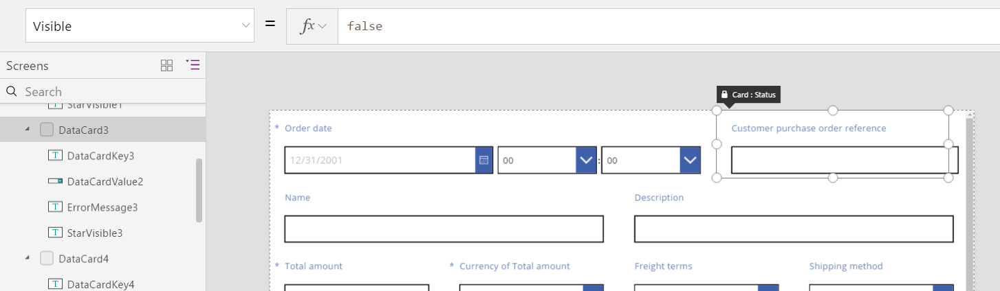

После удаления второй карточки третья карточка может вернуться в строку, в которой находится первая карточка. Для свойства **WidthFit** первой карточки задано значение **True**, и она заполняет все доступное пространство.

Так как элемент **Order status** невидим, его нельзя просто выбрать на холсте. Но можно выбрать любой элемент управления, как видимый, так и нет, в иерархическом списке элементов в левой части экрана.

### Height
Свойство **Height** определяет высоту карточки. У карточек есть аналог **WidthFit** для свойства **Height**, и для него всегда задано значение **True**. Представим, что свойство **HeightFit** существует. Но не ищите его в продукте, так как оно еще не предоставляется.

Это поведение невозможно отключить, поэтому изменение высоты карточек может оказаться непростой задачей. Все карточки в строке будут выровнены по вертикали по самой высокой из них. Пример строки:

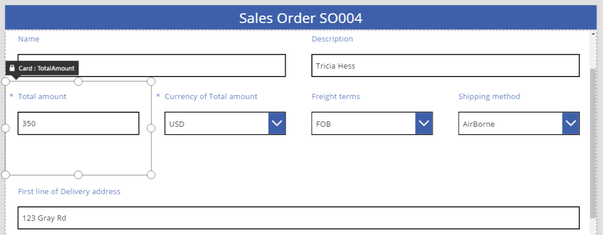

Какая карточка определяет высоту строки? На предыдущем рисунке выбрана карточка **Total amount**, которая выглядит высокой, но ее свойство **Height** имеет значение **80** (как и высота первой строки). Чтобы уменьшить высоту строки, уменьшите свойство **Height** самой высокой карточки в этой строке. Определить самую высокую карточку можно, только если просмотреть свойство **Height** для каждой карточки.

### AutoHeight
Карточка может быть выше, чем ожидалось, если она содержит элемент управления, для свойства **AutoHeight** которого задано значение **true**. Например, многие карточки содержат метку для отображения сообщения об ошибке, если значение поля вызывает ошибку при проверке.

Если отображаемый текст отсутствует (нет ошибки), метка сворачивается до нулевой высоты. Если вы не знали об этом, то не сможете узнать о ее наличии, хотя она должна быть в карточке.

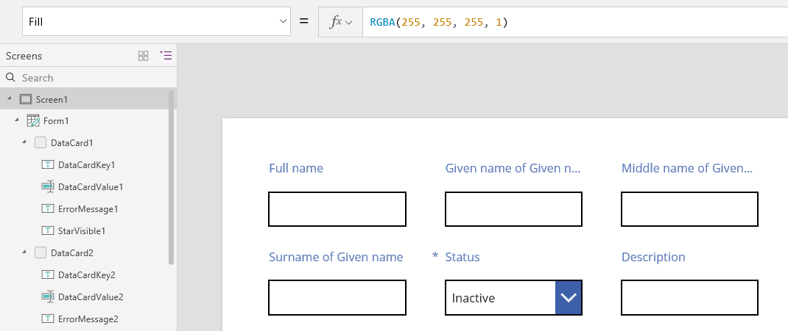

В левой части экрана в списке элементов управления отображается пункт **ErrorMessage1**, который является нашим элементом управления "Метка". При обновлении приложения можно выбрать этот элемент управления, добавив определенное значение высоты. Отобразятся маркеры захвата, с помощью которых можно изменять положение и размеры элемента управления. "A" в голубой рамке означает, что для свойства **AutoHeight** элемента управления задано значение **true**.

Свойству **Text** этого элемента управления присваивается значение **Parent.Error**, которое используется для получения динамических сведений об ошибках на основе правил проверки. Для наглядности зададим статическое значение для свойства **Text** этого элемента управления. Это приведет к увеличению его высоты (и, как следствие, высоты самой карточки) в соответствии с длиной текста.

Давайте немного увеличим размер сообщения об ошибке, и снова размер элемента управления и карточки будет соответственно увеличен. Обратите внимание на то, что высота строки увеличивается, но вертикальный интервал меду карточками не меняется.

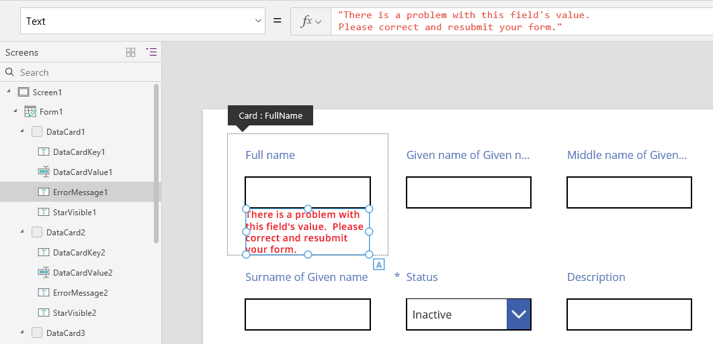

